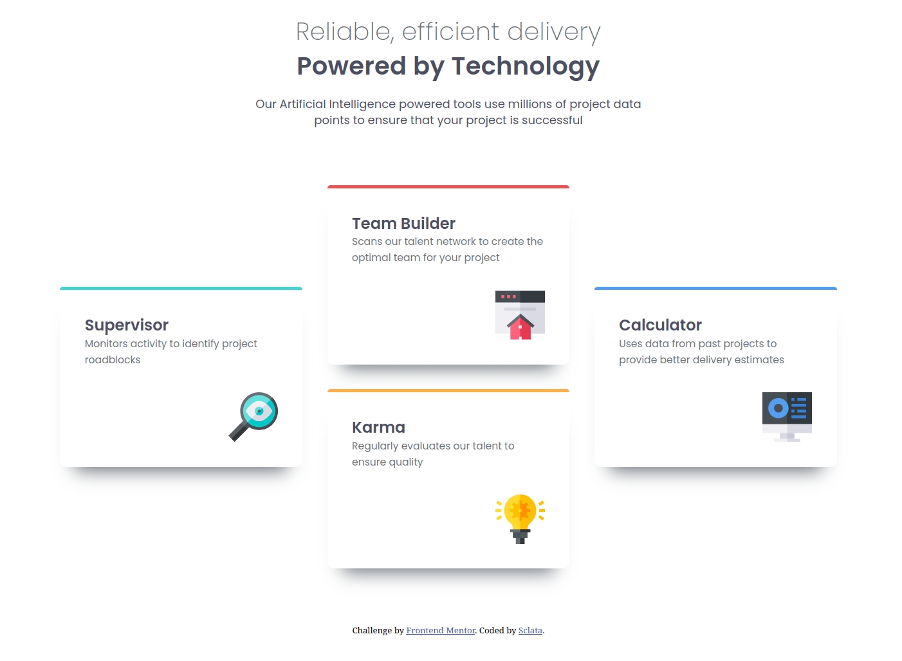
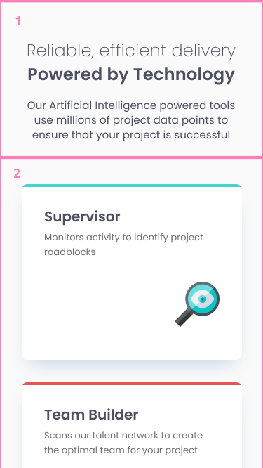
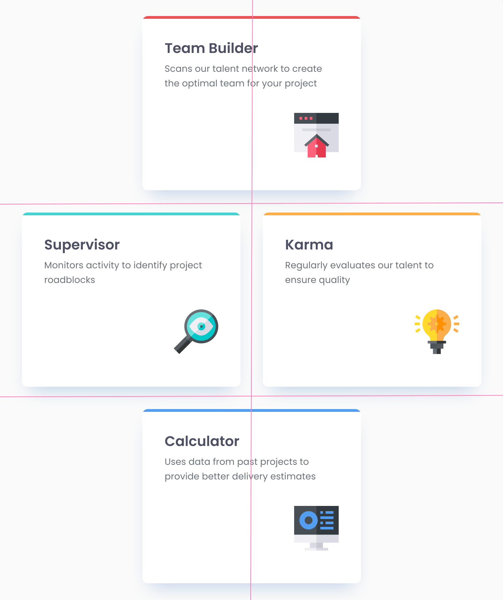
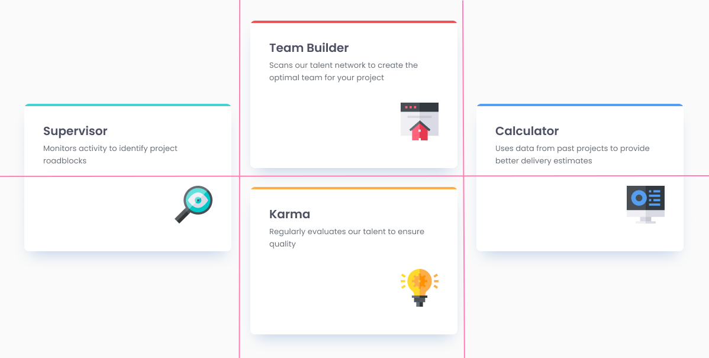

# Frontend Mentor - Four card feature section solution

This is a solution to the [Four card feature section challenge on Frontend Mentor](https://www.frontendmentor.io/challenges/four-card-feature-section-weK1eFYK). Frontend Mentor challenges help you improve your coding skills by building realistic projects. 

## Table of contents

- [Overview](#overview)
  - [The challenge](#the-challenge)
  - [Screenshot](#screenshot)
  - [Links](#links)
- [My process](#my-process)
  - [Built with](#built-with)
  - [What I learned](#what-i-learned)
  - [Continued development](#continued-development)
- [Author](#author)
- [Acknowledgments](#acknowledgments)

**Note: Delete this note and update the table of contents based on what sections you keep.**

## Overview

### The challenge

Users should be able to:

- View the optimal layout for the site depending on their device's screen size

### Screenshot



### Links

- [Solution - Repo](https://github.com/Sclata/four-card-feature-section)
- [Solution - Live Site](https://sclata.github.io/four-card-feature-section)

## My process

### Built with

- Semantic HTML5 markup
- SCSS Preprocessing
- BEM Class Nomenclature
- Flexbox
- CSS Grid
- Mobile-first workflow

### Pre-Solution Analysis

When previewing the design snapshots, starting with mobile and progressing each through tablet (sourced from the figma files) and desktop, the number of rows compresses as more width is added to accommodate additional cards. The general layout includes a header ('1' in the image below) and a grid comprised of cards in the body (2).



The mobile layout is the simplest grid. It is a single-column, four-row grid, with one card per row. Default grid behavior can handle this automatically assuming the HTML is structured to accommodate. The alteration of the grid on expansion of screen dimensions is more interesting:

- Tablet - When the screen is wide enough for two columns in the body (two cards side-by-side), the grid changes dimensions to 3 x 2. The grid contains four grid areas: (1) all cells in the first row, (2) the first cell in the second row, (3) the second / last cell in the second row, and (4) all cells in the last row.



- Desktop - When the screen is wide enough for three columns in the body, the grid changes dimensions once more to a 2 x 3. The grid now contains four new grid areas: (1) all cells in the first column, (2) the top / first cell in the second column, (3) the bottom / last cell in the second columns, and (4) all cells in the last column.



Since there aren't any "dynamic" components and the display will be fairly static, it's easy enough in this case to not overthink the solution and explicitly declare the grid and associated areas in media queries with breakpoints. Since the size of the card component is not altered as screen dimensions change, it can be used as the reference point for the queries. A card appears to take roughly the width of the column in a mobile layout (with padding/margins, etc). With the problem statement in mind and minimum screen width of 320px via WCAG guidelines, I'd estimate the cards are about 300px wide. This would correspond to breakpoints for a two-column layout at about 600px and a three-column layout at about 900 pixels. I have not examined the figma files as of the time of this writing; I'm simply documenting my thought process in attacking this problem.

It should also be noted that the header is constrained to a max width roughly 1.5 times the width of a card (eyeballing) and is centered in the display area. 

My solution will spec scss partials with a component file for the styling of the card components that will populate the grid, and layout files for the header and body each. I will also include some base files with variables for colors and fonts sourced from the figma files / style guide.

### What I learned

#### Elementor Units

Kevin Powell's [video](https://www.youtube.com/watch?v=_-aDOAMmDHI) on elementor units and their respective renderings for different CSS properties (ie - font attributes vs layout attributes like margin and padding) was extremely helpful, though I still need more practice applying each. I did not choose to use any viewport units in this exercise.

#### Internationalization 

Web.Dev's [article](https://web.dev/learn/design/internationalization) on internationalization and deference to logical properties for correct visual rendering in different reading / writing modes was eye-opening. I endeavored to use start/end vs top/bottom or left/right where appropriate.

#### Layout Algorithms

Josh Comeau's interactive articles for [Flexbox](https://www.joshwcomeau.com/css/interactive-guide-to-flexbox/) and [CSS Grid](https://www.joshwcomeau.com/css/interactive-guide-to-grid/) were absolutely foundational in altering the way I think about CSS in general. These articles and the toolsets they introduce, as well as Web.Dev's articles on [Macro](https://web.dev/learn/design/macro-layouts) and [Micro](https://web.dev/learn/design/micro-layouts)layout designs will fundamentally change my approach to solving problem sets and designing my own sites (someday). They also expedited my process for this particular solution. The games linked in Front End Mentor's learning path for Responsive Design were useful as well for some quick practice and re-enforcement of the principles covered in all the linked articles. Highly recommend the learning path. 

### Continued development

Want to continue refining my understanding of different layout modes and how to break out of them. I was proud to patch in a quick layout override on the card banners instead of getting stuck and completely rebuilding the component layout. This would have been a lot more difficult for me without developing the overarching mental model of CSS as explained by Josh Comeau.

```css
// Thin colored line at top of card components

&__banner {
        ...
        position: relative;
        top: -2em;
        left: -2em;
}  
```

I was proud of the organization of my project for this solution. BEM seemed more intuitive this time, especially when paired with SCSS and I have a better understanding of the 7-1 pattern for partials, though I still need to keep working on my overall scaffolding. I wrote a Bash script to build out solution repositories for FEM solutions. I can supply options to direct it to build out solution internals for different tech stacks (ie - SCSS 7-1 pattern, Angular, React, etc) and initialize / map upstream repos. I will continue to refine this in order to expedite the initial project setup.

Perhaps most importantly, I want to work at actually focusing on accessibility in future solutions, making it a primary focus. I also want to better target a mobile-first development pattern. I did this for the first time on this project and it went much better than past submissions.

## Author

- Frontend Mentor - [@Sclata](https://www.frontendmentor.io/profile/Sclata)

## Acknowledgments

Huge thank you to the crew at Front End Mentor for the Responsive Design learning path, and to Kevin Powell and Josh Comeau (links above in 'What I Learned' section) for helping alleviate my frustration when dealing with CSS.
